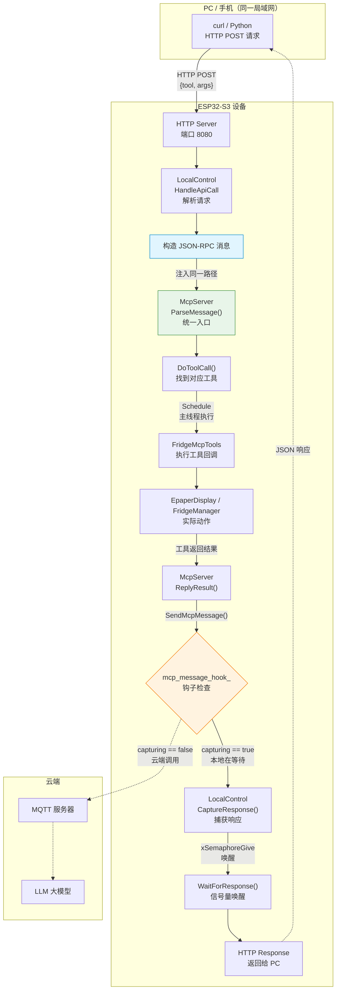
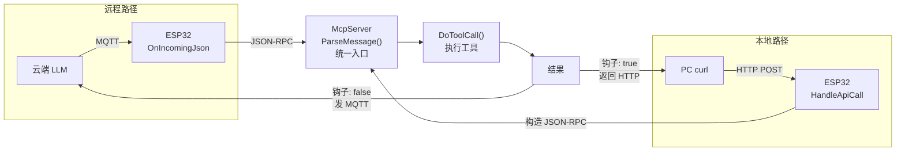

# 小智 MCP 局域网控制 — 流程与概念

## 一、整体流程图



## 二、概念解释

### 2.1 JSON-RPC 是什么

**RPC**（Remote Procedure Call，远程过程调用）= 让另一台机器帮你执行一个函数。

**JSON-RPC** = 用 JSON 格式来描述"你要调哪个函数、传什么参数"。

打个比方，就像去餐厅点菜：

| 角色 | 对应 |
|------|------|
| 你（PC） | 点菜的人 |
| 服务员（JSON-RPC） | 传话的标准格式 |
| 厨房（ESP32） | 实际做菜的人 |

点菜时你说的是标准格式：
```
"我要番茄炒蛋，少盐"
```

JSON-RPC 说的是：
```json
{
  "jsonrpc": "2.0",
  "id": 10000,
  "method": "tools/call",
  "params": {
    "name": "fridge.pagemanager",
    "arguments": {"target_page": 3}
  }
}
```

在这个项目里，云端 LLM 和我们的 HTTP 接口都用这个"点菜格式"来告诉 ESP32 要调用哪个 MCP 工具。`McpServer` 就是"服务员"，收到 JSON-RPC 后找到对应工具并执行。

### 2.2 钩子（Hook）是什么

钩子 = 在已有的代码流程里**插一个关卡**，让外部代码有机会介入。

**原来的流程**（不加钩子）：
```
工具执行完 → 结果发往云端 MQTT（固定路线，无法改变）
```

**加了钩子之后**：
```
工具执行完 → 🔒 钩子检查点
                ├─ 有人在等吗？→ 是 → 把结果给 HTTP，不发云端
                └─ 没人在等？→ 否 → 照常发云端 MQTT
```

代码上的体现，就是在 `SendMcpMessage` 函数开头加了几行：

```cpp
void Application::SendMcpMessage(const std::string& payload) {
    // 这个 if 就是"钩子"——一个可插拔的检查点
    if (mcp_message_hook_) {
        if (mcp_message_hook_(payload)) {
            return;  // 被本地捕获了，后面的 MQTT 不执行
        }
    }
    // 没被捕获，正常发云端
    protocol_->SendMcpMessage(payload);
}
```

`mcp_message_hook_` 是一个函数指针：
- **平时是空的** → 不影响云端正常工作
- **HTTP 请求来了** → 设成"等待捕获"状态 → 工具结果就改道给 HTTP

不需要改 MCP 框架本身的代码，只是在出口处加了个"关卡"。

## 三、本地 HTTP vs 云端 LLM：为什么能做到同样的事



**关键点**：不管请求从哪里来，最终都汇聚到 `McpServer::ParseMessage()` 这一个入口。MCP 框架不关心消息是 MQTT 来的还是 HTTP 来的，它只认 JSON-RPC 格式。

唯一的区别是**结果往哪发**——由钩子决定：
- 云端调用 → 钩子放行 → 结果发 MQTT → LLM 收到
- 本地调用 → 钩子拦截 → 结果给 HTTP → PC 收到

**所以本地测通的工具，云端 LLM 调用也一定能用。**
